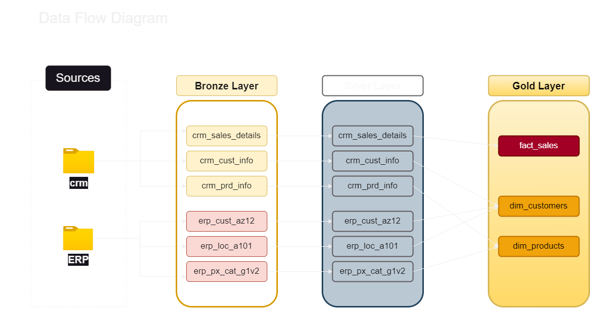
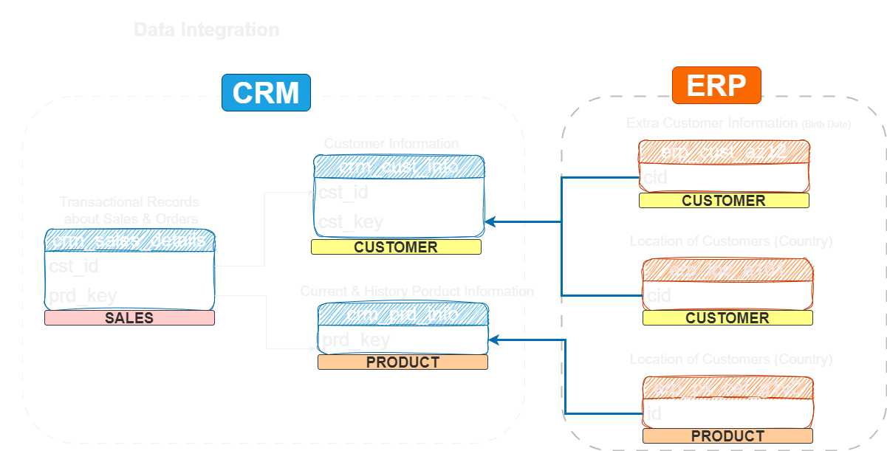
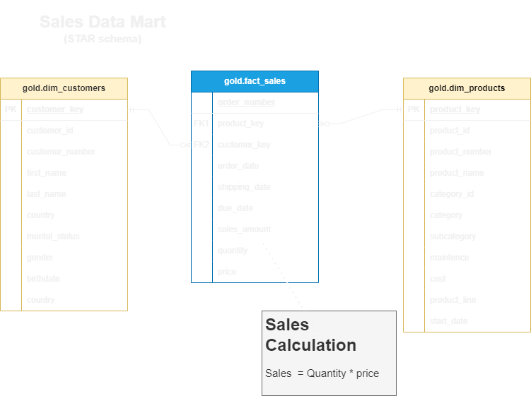

# Sales Data Warehouse Project | SQL
This project showcases end-to-end data warehousing skills, from designing to building a data warehouse from scratch.

The data architecture for this project follows Medallion Architecture **Bronze**, **Silver**, and **Gold** layers:

---

##  Project Overview

This project involves:
1. **Data Architecture**: Designing a modern data warehouse using Medallion Architecture (Bronze, Silver, Gold).
2. **ETL Pipelines**: Extracting, transforming, and loading data from source systems into the warehouse.
3. **Data Modeling**: Developing fact and dimension tables optimized for analytical queries.

---

# Detailed Project Structure

## 🟤 Bronze Layer - Raw Data Ingestion

The Bronze Layer represents the initial raw ingestion of CRM and ERP source files into the data warehouse.

### Key Actions:
- Created raw staging tables in the `bronze` schema.
- Implemented a `bronze.load_bronze` stored procedure:
  - Truncates tables.
  - Loads CSV data using `BULK INSERT`.
  - Logs load durations and batch times.

### Tables:
- `bronze.crm_cust_info`
- `bronze.crm_prd_info`
- `bronze.crm_sales_details`
- `bronze.erp_cust_az12`
- `bronze.erp_loc_a101`
- `bronze.erp_px_cat_g1v2`

### Purpose:
- Preserve raw source data without transformation.
- Serve as the base for further processing in the Silver Layer.

---

## ⚪ Silver Layer - Data Cleansing and Standardization

The Silver Layer refines and standardizes the raw data ingested from the Bronze Layer.

### Key Actions:
- Created cleaned and standardized tables in the `silver` schema.
- Implemented a `silver.load_silver` stored procedure:
  - Standardized gender, marital status, and country names.
  - Corrected invalid dates and missing sales or price fields.
  - Applied data cleaning and normalization.

### Tables:
- `silver.crm_cust_info`
- `silver.crm_prd_info`
- `silver.crm_sales_details`
- `silver.erp_cust_az12`
- `silver.erp_loc_a101`
- `silver.erp_px_cat_g1v2`

### Purpose:
- Improve data consistency, quality, and usability.
- Prepare analysis-ready datasets for modeling in the Gold Layer.

---

## 🟡 Gold Layer - Business-Ready Star Schema

The Gold Layer consolidates cleansed data into a final star schema ready for analytics and reporting.

### Key Actions:
- Created analytical views in the `gold` schema:
  - `gold.dim_customers`
  - `gold.dim_products`
  - `gold.fact_sales`
- Built a complete Star Schema:
  - **Fact Table**: `fact_sales`
  - **Dimension Tables**: `dim_customers`, `dim_products`
- Integrated CRM and ERP data to enrich customer and product profiles.

### Purpose:
- Deliver a high-quality, structured data model optimized for business intelligence, data analysis.

---

#  Tools and Technologies

- SQL Server
- ETL Pipelines (Stored Procedures, BULK INSERT)
- Star Schema Design
- Medallion Architecture (Bronze, Silver, Gold)

